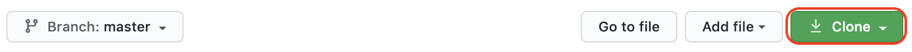
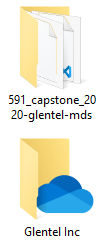
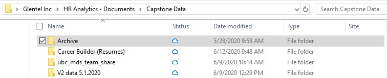
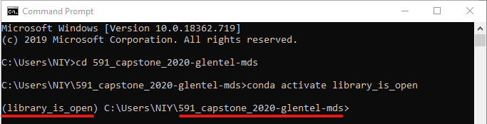
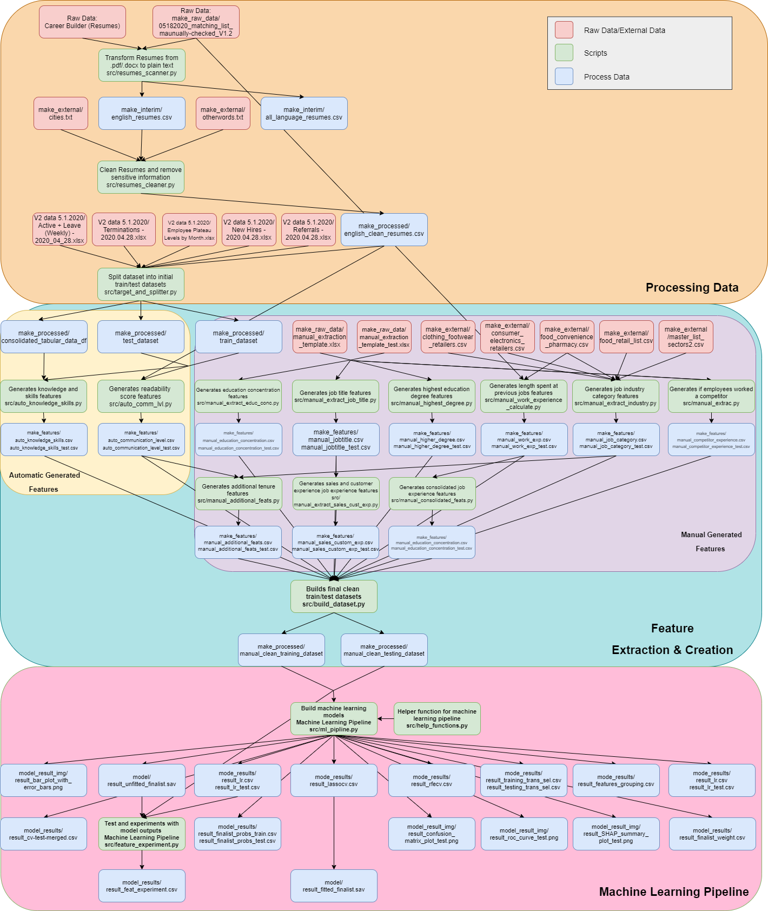

<h3 align="center">Glentel Inc | Identifying and Analyzing Traits Associated with High Performers</h3>

<p align="center"> As part of the Master of Data Science Program at UBC, we have partnered with Glentel Inc to analyze the traits of their employees to determine the most significant traits of high performing employees and to apply natural language processing on resumes.
    <br>
</p>

## Table of Contents
- [About](#about)
- [Getting Started](#getting_started)
- [Dependencies](#dependencies)
- [Analysis](#analysis)
- [Navigating the Repository](#repo)
- [Results](#results)
- [Trouble Shooting](#trouble_shooting)
- [Authors](#authors)
- [Acknowledgments](#acknowledgement)


## About <a name = "about"></a>

Glentel is a mobile phone retailer that operates 350+ wireless outlets across Canada. They have requested assistant on understanding the traits of their employees. The goal of this study is to identify traits extracted from their resumes of high performers within their organization. This will provide Glentel with valuable insight to help them decrease employee churn and optimizer their hiring process. 

## Getting Started <a name = "getting_started"></a>

*Note: The below instructions assumes you have Python 3 installed on your computer. If you need to install Python, you can refer to [Anaconda](https://www.anaconda.com/distribution/#macos), an easy-to-install distribution of Python.*

First, obtain the code by cloning the repository. Open up the program **Git Bash** console and enter the following commands:

```
git clone **github_url**
```

The **github_url** can be obtained by copying and pasting the url under the clone button as demonstrated in the image below.




Second, move the project repository so it is in a shared folder as the `Glentel Inc` OneDrive folder as shown in the image below.




Third, ensure that the Glentel Inc OneDrive is synced with the most current version. This can be achieved by:

1.	https://glentel.sharepoint.com/sites/hranalytics/Shared%20Documents/Forms/AllItems.aspx?viewid=bb9114b0%2D0d14%2D4a3c%2D9442%2D9d4f2abdf615
2.	Click on `Return to classic SharePoint` in the bottom left corner of the page
3.	Click on the `Sync` button in the middle of the page. 

If the sync was successfully completed, then you should have access to this files system with a “cloud” icon in the status column similar to the images below. 




and the path of `Glentel Inc /HR Analytics - Documents/Capstone Data/` should be available.

## Start up Virtual Environment Container 

If this is the **first time running this analysis**, please open the program **Command Prompt**, and run the following commands below.

```
cd 591_capstone_2020-glentel-mds
conda remove --name library_is_open --all --yes
conda env create -f environment.yml
conda activate library_is_open
python -m spacy download en_core_web_sm
conda install -c conda-forge shap
```

If you have successfully run this analysis before then use the following commands: 

```
cd 591_capstone_2020-glentel-mds
conda activate library_is_open
```

## Start up Software Requirements 

If you would prefer not to use the virtual environment container and would rather install the software on your machine, then please run the following commands in the command prompt:  

```
cd 591_capstone_2020-glentel-mds
pip install -r requirements.txt
python -m spacy download en_core_web_sm
conda install -c conda-forge shap
```

## Analysis <a name = "analysis"></a>
Before continuing remember to activate the virtual environment but executing a program the following commands in the **Command Prompt** program.
```
cd 591_capstone_2020-glentel-mds
conda activate library_is_open
```
your comand window should looks similar to this the image below.



After all software has been properly installed, to fully recreate this analysis from start to end please run the following command. 

```
make all
```

To run this analysis with a "fresh start" by removing all script output files and recreating the output files, please run the following commands in the **Command Prompt** program.

```
make clean
make all
```

### Analysis Step-By-Step

The following commands in the **Command Prompt** program will rerun portions of the analysis:

```
make process_resumes 
```
This command above will extract and clean the text of resumes in the file `Career Builder (Resumes)/Career Builder (Resumes) Before May 18`.


```
make auto_features
```
This command above will take the plain text taken from the resumes and create features.


```
make manual_features 
```
This command above will take information manual scrap resume information by a human in the `make_raw_data/manual_extraction_template.xlsx`.

```
make dataset
```
This command above will merge the features created in earlier steps and combine them into one data frame for downstream machine learning pipeline.

```
make train_model 
```
This command above will take the created upstream data sets and run the machine learning pipeline of feature selecting and model training.

**`make all` is the sumation of running all the scripts above**

## Dashboard 

Once `make all` has successfully been executed once. Then run the following command to open the app:

```
make app
```


## Dependencies <a name="dependencies"></a>

Below is a dependency diagramed that to demonstrate how all the scripts in this repository’s interaction between each other. When ‘make all’ is called then it will run all the scripts inorder to produce the final dashboard and report. 




## Navigating the Repository <a name="repo"></a>

Below is the file directory and folder structure of this GitHub repository. By cloning this repository, the locale files should resemble the file structure below. 

```
.
+-- requirements.txt
+-- README.md
+-- Makefile
+-- environment.yml
+-- CONTRIBUTING
+-- CODE_OF_CONDUCT
+-- src
|   +-- dashboard
|   +-- data_cleaning
|   +-- feature_extraction
|   +-- model_pipeline
|   +-- other_notebooks
|   +-- README.md
+-- model
|   +-- model_results
|   +-- topic_model
|   +-- result_fitted_finalist.sav
|   +-- result_unfitted_finalist.sav
+-- img
|   +-- model_results_img
+-- doc
|   +-- eda 
|   +-- project_final_presentation
|   +-- project_final_report
|   +-- project_proposal_presentation
|   +-- project_proposal_report
|   +-- Team_Contract.md
+-- data
|   +-- data.txt

```

The folder structure and project organization has been adapted from [Cookiecutter Data Science](https://drivendata.github.io/cookiecutter-data-science/)

## Results <a name="results"></a>

**[Final Report Link](https://github.com/UBC-MDS/591_capstone_2020-glentel-mds/blob/master/doc/project_final_report/project_final_report.md)**


#### Final 9 Features

##### Negative Features:

- flag_hd_highschool
- fitness_sport_jobtitle

##### Postive Features
- competitor_experience
- sales_customer_base_exp
- trilingual_flag
- finance_concentration
- shortest_tenure
- cashier_jobtitle
- communication_skills

## Trouble Shooting <a name = "trouble_shooting"></a>

If you are having issues installing some of the necessary data science software, then please consult the following [link](https://ubc-mds.github.io/resources_pages/install_ds_stack_windows/#git).


The main software required is

-	Git
-	Python
-	R
-	RStudio
-	Rtools
-	Rscript
-	Make
  
## Authors <a name = "authors"></a>


Manual Maldonado | [@manu2856](https://github.com/manu2856)

Robert Pimentel | [@robilizando](https://github.com/robilizando)

Thomas Pin | [@MrThomasPin](https://github.com/MrThomasPin)

Haoyu (Clara) Su | [@clsu22](https://github.com/clsu22)

## Acknowledgements <a name = "acknowledgements"></a>

We would like to thank and acknowledge the amazing support from the Glentel Team Elena Bobyreva, Keith Nowak, Joshlynn Kishore and Justin Chinfen who provided us with the data and engaged with our analysis through-out the entire project. In addition, we would like to thank our UBC mentor instructor Varada Kolhatkar for their guidance and wisdom. 
