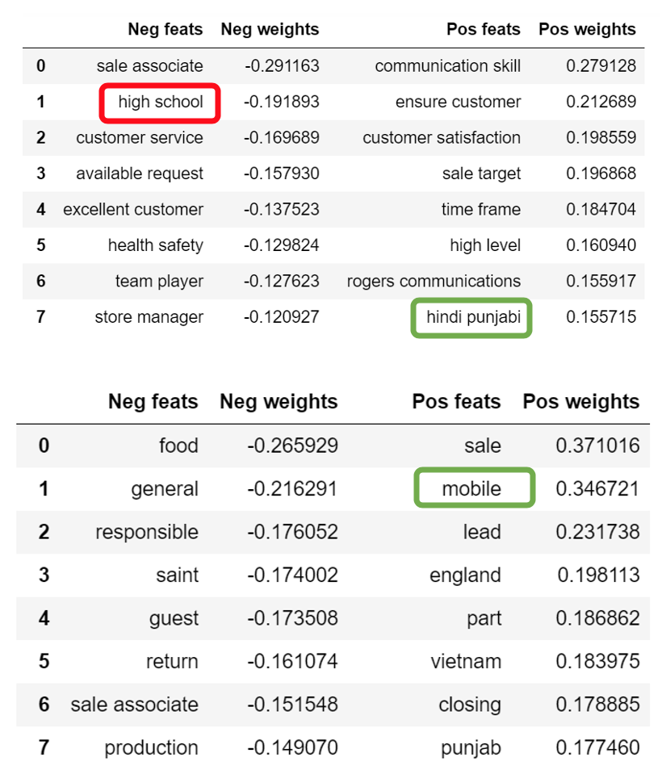
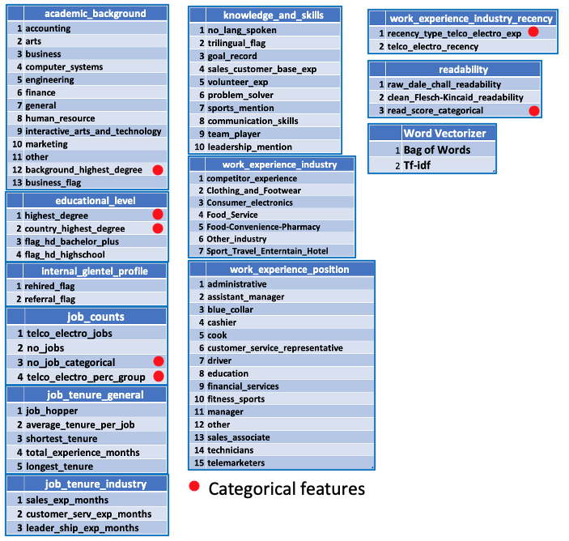
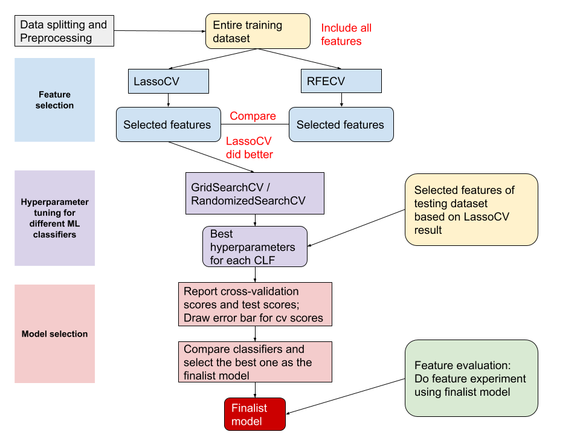
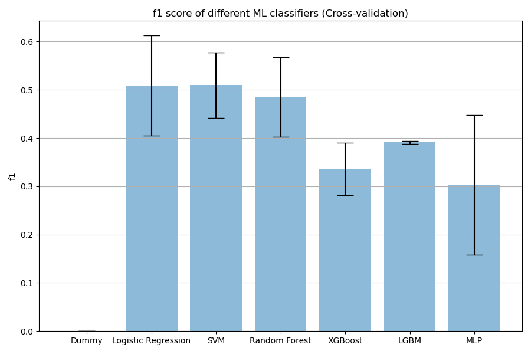
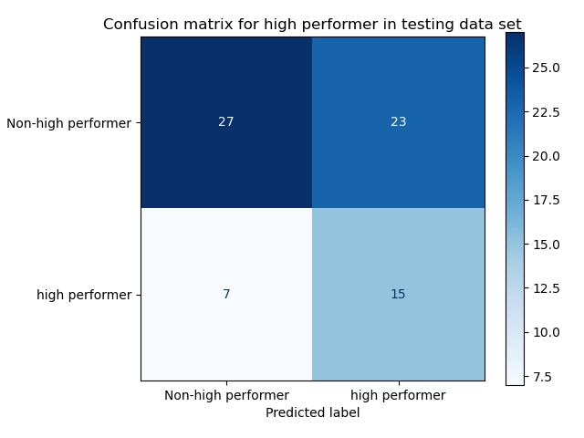
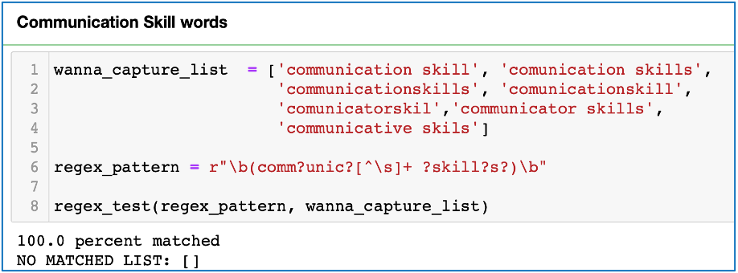
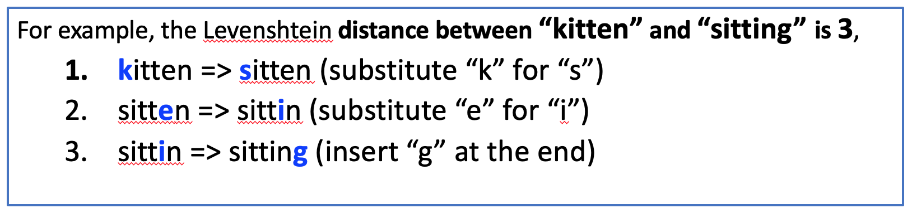
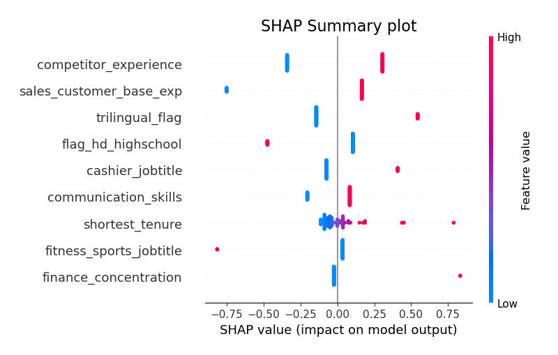
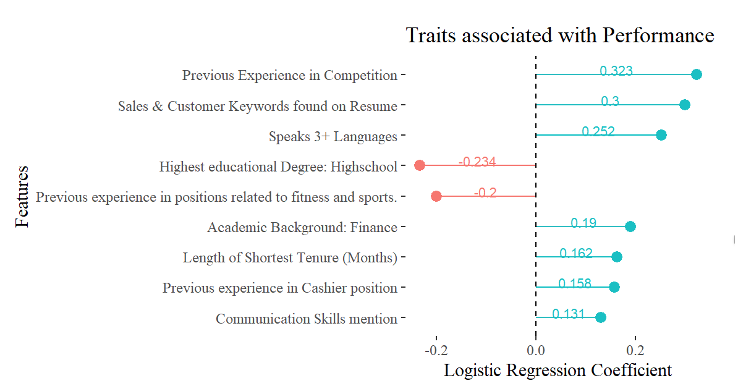

Identifying and Analyzing Traits Associated with High Performers
================
Manuel Maldonado, Robert Pimentel, Thomas Pin, and Haoyu (Clara) Su  
  
**Mentor**: Varada Kolhatkar  
**Partner**: Glentel   
June 29, 2020

  - [Executive Summary](#executive-summary)
  - [Introduction](#introduction)
      - [Data Science Problem / Scientific
        Objective](#data-science-problem-scientific-objective)
  - [Data Science Methods](#data-science-methods)
      - [Corpus Extraction](#corpus-extraction)
      - [Corpus Cleaning and
        Preprocessing](#corpus-cleaning-and-preprocessing)
      - [Feature Engineering](#feature-engineering)
      - [Feature Engineering Techniques (Bag of Words and Regex
        Keywords)](#feature-engineering-techniques-bag-of-words-and-regex-keywords)
          - [Summary of generated
            features](#summary-of-generated-features)
      - [Machine Learning Pipeline](#machine-learning-pipeline)
  - [Results and Data Product](#results-and-data-product)
      - [Results](#results)
      - [Data Product](#data-product)
  - [Conclusion and Recommendations](#conclusion-and-recommendations)
      - [Conclusion](#conclusion)
      - [Recommendations](#recommendations)
  - [Appendices](#appendices)
      - [Appendix TO DO Regex Example](#appendix-to-do-regex-example)
      - [Appendix TO DO Feature categories
        definitions](#appendix-to-do-feature-categories-definitions)
      - [EDA (Quick summary of
        findings)](#eda-quick-summary-of-findings)
      - [Chopping Block](#chopping-block)
          - [Feature Engineering Techniques (Normalized Levenshtein
            distance-similarity
            algorithm)](#feature-engineering-techniques-normalized-levenshtein-distance-similarity-algorithm)
          - [Feature Engineering Techniques (Topic
            Modeling)](#feature-engineering-techniques-topic-modeling)

# Executive Summary

Glentel is a mobile phone retailer that operates 350+ outlets across
Canada. The primary issue they face is high employee churn within the
first three month of employment. The Master of Data Science (MDS) team
proposed to solve this by implementing natural language processing
techniques. Specifically, we extracted 68 relevant features from
employee resumes related to academic background, employment history, job
tenure, work experience, knowledge and skills, writing style and text
complexity. Then, we developed supervised machine learning models to
identify the features most relevant to high performers. Based on our
analysis, we recommend Glentel look into nine features selected by the
model in order to optimize the company’s hiring process and decrease
employee churn.

Seven features contribute positively to their performance within Glentel

  - Experience working for Glentel competitors
  - Sales & customer keywords
  - Speaking 3+ languages
  - Finance related degrees
  - Length of shortest tenure
  - Experience in a cashier position
  - Mentioning communication skills

Two features contribute negatively to their performance within Glentel.

  - High school degree completion only
  - Experience in fitness and sports related positions

# Introduction

## Data Science Problem / Scientific Objective

Glentel is seeking tools to introduce quantitative procedures to their
hiring process. In light of the current COVID-19 crisis, it’s critical
that retail organizations have a deep understanding of their workforce.
The question our team seeks to answer is “What traits are associated
with employees who become high performers?”. Our team determined the
main scientific objective of the study was the development of a
predictive classification model, which would allow us to generate the
quantitative data analysis necessary to solve the issue and provide
Glentel with a tool required to make informed decisions when hiring that
will decrease turnover and optimize their workforce. For further
explanation of “data” and “target” please see the [Project
Proposal](https://github.com/UBC-MDS/591_capstone_2020-glentel-mds/blob/master/doc/project_proposal_report/project_proposal_report.md).

# Data Science Methods

## Corpus Extraction

Due formatting differences in resumes, we focused on finding a data
loading solution that could accommodate PDF and doc/docx files. To load
PDF files, we tested
[“pdf-plumber”](https://github.com/jsvine/pdfplumber) and for docx
resumes we tested
[“python-docx”](https://python-docx.readthedocs.io/en/latest/)
However, neither accommodated doc files. We discovered that
[“tika”](https://github.com/chrismattmann/tika-python) allowed us to
extract plain text from all resume formats.

## Corpus Cleaning and Preprocessing

Whole resumes were loaded in as single text strings. For readability and
manipulation, we decided to have 3 versions: a raw version
(raw\_resume), a version that could be read line-by-line
(resume\_bline), and a clean processed version (clean\_text). This
process was achieved by using [spaCy](https://spacy.io/) and
[Regex](https://docs.python.org/3/library/re.html). Personal information
was removed and replaced with a unique Glentel identifier. Stop words
were also removed.

## Feature Engineering

The process of feature engineering can be summarized into three
iterative phases: designing, extracting and testing. In the design phase
a function is developed to search for a phrase, word or pattern in the
text. Information is then extracted by applying the function over the
whole resume corpus and manually testing whether the function is
retrieving properly or whether the search should be limited to certain
sections of the text to improve extraction accuracy. Because the resume
data was unstructured, we manually extracted information relating to job
experience and education. Given our time constraints, this was the most
direct method. However, this results in a loss of scalability for
additional data. Additionally, information extraction is an entirely
different project and not our main focus.

To see the type of information collected, see the table below or refer
to the original excel files through this
[link](https://glentel.sharepoint.com/:x:/s/hranalytics/EQpvZ4Tgw1pHj5IU3bPSanUBrQc6CUnBxm6mp16Ho0dpJw?e=GfjHpZ)

<table>

<caption>

Table 1. Manually extracted features template

</caption>

<thead>

<tr>

<th style="text-align:left;">

Employee Code

</th>

<th style="text-align:left;">

Work\#\_title

</th>

<th style="text-align:left;">

Work\#\_company

</th>

<th style="text-align:left;">

Work\#\_time

</th>

<th style="text-align:left;">

Education\#\_school

</th>

<th style="text-align:left;">

Education\#\_degree

</th>

<th style="text-align:left;">

Education\#\_concentration

</th>

<th style="text-align:left;">

Education\#\_country

</th>

</tr>

</thead>

<tbody>

<tr>

<td style="text-align:left;">

N\*\*

</td>

<td style="text-align:left;">

Sales Associate

</td>

<td style="text-align:left;">

Virgin Mobile

</td>

<td style="text-align:left;">

Jan 2017 – Present

</td>

<td style="text-align:left;">

York University

</td>

<td style="text-align:left;">

Bachelor

</td>

<td style="text-align:left;">

Business

</td>

<td style="text-align:left;">

Canada

</td>

</tr>

<tr>

<td style="text-align:left;">

M\*\*

</td>

<td style="text-align:left;">

Cashier

</td>

<td style="text-align:left;">

McDonalds

</td>

<td style="text-align:left;">

Jun 2019 – Current

</td>

<td style="text-align:left;">

Fraser Valley University

</td>

<td style="text-align:left;">

Bachelor

</td>

<td style="text-align:left;">

Arts

</td>

<td style="text-align:left;">

Canada

</td>

</tr>

<tr>

<td style="text-align:left;">

N\*\*

</td>

<td style="text-align:left;">

Store Manager

</td>

<td style="text-align:left;">

Walmart

</td>

<td style="text-align:left;">

March 2008 to May 2013

</td>

<td style="text-align:left;">

St Joan Arc Catholic

</td>

<td style="text-align:left;">

High School

</td>

<td style="text-align:left;">

General

</td>

<td style="text-align:left;">

Canada

</td>

</tr>

</tbody>

</table>

We subdivided features two groups: manually extracted features and
automatic extracted features. Manually extracted features rely on
information from the manually extracted template (Table 1) and automatic
features are created directly from the resume corpus.

## Feature Engineering Techniques (Bag of Words and Regex Keywords)

We ran a simple logistic regression model using a Bag of Words (BOW)
technique on the clean text resumes to determine words or phrases that
directly correlated with high performance. This was done through a
combination of bi-grams and uni-grams combined with two vectorizing
algorithms,
[CountVectorizer](https://scikit-learn.org/stable/modules/generated/sklearn.feature_extraction.text.CountVectorizer.html)
and
[TfidfVectorizer](https://scikit-learn.org/stable/modules/generated/sklearn.feature_extraction.text.TfidfVectorizer.html).

Figure 5. Logistic Regression Bag of Words experiments for Feature
Engineering. Highlight features are examples of features we further
investigated and directly related to our final model.

However, this naïve method was not providing our desired accuracy and F1
score. Additionally, Regex keyword search was used on the manually
extracted template to focus the model on more relevant features rather
than all possible words in the resume’s corpora. For an example of Regex
extraction, see appendix \_.

### Summary of generated features

The total number features generated to feed into the machine learning
model pipeline was 68, 18 of which are automatic features and 50 are
manual features. The features were grouped into 11 categories as shown
in the table below. Refer to appendix \_ for further explanation of the
categories.

<table class="table" style="font-size: 14px; width: auto !important; margin-left: auto; margin-right: auto;">

<caption style="font-size: initial !important;">

Table 2. Features Category Groups

</caption>

<thead>

<tr>

<th style="text-align:left;">

n

</th>

<th style="text-align:left;">

Feature\_Category\_Group

</th>

<th style="text-align:right;">

Total\_Features

</th>

</tr>

</thead>

<tbody>

<tr>

<td style="text-align:left;">

1

</td>

<td style="text-align:left;">

academic\_background

</td>

<td style="text-align:right;">

13

</td>

</tr>

<tr>

<td style="text-align:left;">

2

</td>

<td style="text-align:left;">

educational\_level

</td>

<td style="text-align:right;">

4

</td>

</tr>

<tr>

<td style="text-align:left;">

3

</td>

<td style="text-align:left;">

internal\_glentel\_profile

</td>

<td style="text-align:right;">

2

</td>

</tr>

<tr>

<td style="text-align:left;">

4

</td>

<td style="text-align:left;">

job\_counts

</td>

<td style="text-align:right;">

4

</td>

</tr>

<tr>

<td style="text-align:left;">

5

</td>

<td style="text-align:left;">

job\_tenure\_general

</td>

<td style="text-align:right;">

5

</td>

</tr>

<tr>

<td style="text-align:left;">

6

</td>

<td style="text-align:left;">

job\_tenure\_industry

</td>

<td style="text-align:right;">

3

</td>

</tr>

<tr>

<td style="text-align:left;">

7

</td>

<td style="text-align:left;">

knowledge\_and\_skills

</td>

<td style="text-align:right;">

10

</td>

</tr>

<tr>

<td style="text-align:left;">

8

</td>

<td style="text-align:left;">

readability

</td>

<td style="text-align:right;">

3

</td>

</tr>

<tr>

<td style="text-align:left;">

9

</td>

<td style="text-align:left;">

work\_experience\_industry

</td>

<td style="text-align:right;">

7

</td>

</tr>

<tr>

<td style="text-align:left;">

10

</td>

<td style="text-align:left;">

work\_experience\_industry\_recency

</td>

<td style="text-align:right;">

2

</td>

</tr>

<tr>

<td style="text-align:left;">

11

</td>

<td style="text-align:left;">

work\_experience\_position

</td>

<td style="text-align:right;">

15

</td>

</tr>

<tr>

<td style="text-align:left;">

</td>

<td style="text-align:left;">

Grand\_Total

</td>

<td style="text-align:right;">

68

</td>

</tr>

</tbody>

</table>

A detailed summary of features within each category group can be found
in the following figure and a simple description for each one is located
in appendix \_.

Figure 7. Engineered Features Summary

There were 68 features, 7 categorical and 61 numeric.

## Machine Learning Pipeline

The machine learning pipeline can be divided into 5 steps: data
splitting, preprocessing, feature selection, hyperparameter tuning and
model selection via scikit-learn (Pedregosa et al. 2011). The experiment
is conducted to evaluate the use of features. Three baseline models were
used, a dummy classifier, Bag-of-word (BOW) model and TF-IDF model.
Because of the limited dataset, 5-fold cross-validation is applied
through the pipeline in order to use our data efficiently

Figure 8. ML pipeline flow chart

Figure 8. ML pipeline flow chart As shown in Figure 8, this pipeline
begins with an 80/20 train-test split. Data preprocessing is conducted
where one-hot encoding, standardization, and imputation are applied to
transform, standardize and fill in missing values. At the feature
selection step, L1 regularization and recursive feature elimination
(RFE) are applied with cross-validation
[LassoCV](https://scikit-learn.org/stable/modules/generated/sklearn.linear_model.LassoCV.html)
is applied because L1 regularization decreases irrelevant coefficients
to zero.
[RFECV](https://scikit-learn.org/stable/modules/generated/sklearn.feature_selection.RFECV.html)
is applied to recursively eliminate the weakest features. Hyperparameter
tuning for different classifiers - Logistic regression, SVM RBF, Random
Forest, XGBoost, LGBM and Multi-layer perceptron - is conducted
respectively using selected features. The hyperparameter class\_weight
is tuned specifically for the imbalanced dataset. F1 score was used
instead of accuracy as the key metric, because it was the recommended
metric for unbalanced datasets (Sasaki 2007). An experiment was
conducted by excluding one feature group at a time, repeating LassoCV
selection and refitting the unfitted finalist model. In the feature
selection, LassoCV’s result was chosen because it can deal with
multicollinearity whereas RFECV cannot.

The feature experiment’s result is shown in table 3. The model
containing all features performs better than models missing features.
Additionally, F1 scores drop dramatically when the work experience
industry group is excluded, suggesting the it has a great contribution
to the model.

<table>

<caption>

Table 3. Feature experiment result

</caption>

<thead>

<tr>

<th style="text-align:left;">

</th>

<th style="text-align:left;">

Cross-validation

</th>

<th style="text-align:left;">

</th>

<th style="text-align:left;">

</th>

<th style="text-align:left;">

Test

</th>

<th style="text-align:left;">

</th>

<th style="text-align:left;">

</th>

</tr>

</thead>

<tbody>

<tr>

<td style="text-align:left;">

</td>

<td style="text-align:left;">

Recall

</td>

<td style="text-align:left;">

Precision

</td>

<td style="text-align:left;">

F1

</td>

<td style="text-align:left;">

Recall

</td>

<td style="text-align:left;">

Precision

</td>

<td style="text-align:left;">

F1

</td>

</tr>

<tr>

<td style="text-align:left;">

Model

</td>

<td style="text-align:left;">

</td>

<td style="text-align:left;">

</td>

<td style="text-align:left;">

</td>

<td style="text-align:left;">

</td>

<td style="text-align:left;">

</td>

<td style="text-align:left;">

</td>

</tr>

<tr>

<td style="text-align:left;">

Baseline 1: bag–of–word with lr

</td>

<td style="text-align:left;">

0.800

</td>

<td style="text-align:left;">

0.242

</td>

<td style="text-align:left;">

0.369

</td>

<td style="text-align:left;">

0.773

</td>

<td style="text-align:left;">

0.274

</td>

<td style="text-align:left;">

0.405

</td>

</tr>

<tr>

<td style="text-align:left;">

Baseline 2: tf–idf with lr

</td>

<td style="text-align:left;">

0.943

</td>

<td style="text-align:left;">

0.236

</td>

<td style="text-align:left;">

0.377

</td>

<td style="text-align:left;">

0.500

</td>

<td style="text-align:left;">

0.355

</td>

<td style="text-align:left;">

0.415

</td>

</tr>

<tr>

<td style="text-align:left;">

all features

</td>

<td style="text-align:left;">

0.700

</td>

<td style="text-align:left;">

0.402

</td>

<td style="text-align:left;">

0.509

</td>

<td style="text-align:left;">

0.682

</td>

<td style="text-align:left;">

0.395

</td>

<td style="text-align:left;">

0.500

</td>

</tr>

<tr>

<td style="text-align:left;">

– academic background

</td>

<td style="text-align:left;">

0.729

</td>

<td style="text-align:left;">

0.377

</td>

<td style="text-align:left;">

0.485

</td>

<td style="text-align:left;">

0.682

</td>

<td style="text-align:left;">

0.429

</td>

<td style="text-align:left;">

0.526

</td>

</tr>

<tr>

<td style="text-align:left;">

– educational level

</td>

<td style="text-align:left;">

0.714

</td>

<td style="text-align:left;">

0.384

</td>

<td style="text-align:left;">

0.497

</td>

<td style="text-align:left;">

0.591

</td>

<td style="text-align:left;">

0.361

</td>

<td style="text-align:left;">

0.448

</td>

</tr>

<tr>

<td style="text-align:left;">

– internal glentel profile

</td>

<td style="text-align:left;">

0.700

</td>

<td style="text-align:left;">

0.402

</td>

<td style="text-align:left;">

0.509

</td>

<td style="text-align:left;">

0.682

</td>

<td style="text-align:left;">

0.395

</td>

<td style="text-align:left;">

0.500

</td>

</tr>

<tr>

<td style="text-align:left;">

– job counts

</td>

<td style="text-align:left;">

0.700

</td>

<td style="text-align:left;">

0.402

</td>

<td style="text-align:left;">

0.509

</td>

<td style="text-align:left;">

0.682

</td>

<td style="text-align:left;">

0.395

</td>

<td style="text-align:left;">

0.500

</td>

</tr>

<tr>

<td style="text-align:left;">

– job tenure general

</td>

<td style="text-align:left;">

0.700

</td>

<td style="text-align:left;">

0.424

</td>

<td style="text-align:left;">

0.527

</td>

<td style="text-align:left;">

0.591

</td>

<td style="text-align:left;">

0.361

</td>

<td style="text-align:left;">

0.448

</td>

</tr>

<tr>

<td style="text-align:left;">

– job tenure industry

</td>

<td style="text-align:left;">

0.700

</td>

<td style="text-align:left;">

0.402

</td>

<td style="text-align:left;">

0.509

</td>

<td style="text-align:left;">

0.682

</td>

<td style="text-align:left;">

0.395

</td>

<td style="text-align:left;">

0.500

</td>

</tr>

<tr>

<td style="text-align:left;">

– knowledge and skills

</td>

<td style="text-align:left;">

0.671

</td>

<td style="text-align:left;">

0.284

</td>

<td style="text-align:left;">

0.382

</td>

<td style="text-align:left;">

0.591

</td>

<td style="text-align:left;">

0.419

</td>

<td style="text-align:left;">

0.491

</td>

</tr>

<tr>

<td style="text-align:left;">

– readability

</td>

<td style="text-align:left;">

0.700

</td>

<td style="text-align:left;">

0.402

</td>

<td style="text-align:left;">

0.509

</td>

<td style="text-align:left;">

0.682

</td>

<td style="text-align:left;">

0.395

</td>

<td style="text-align:left;">

0.500

</td>

</tr>

<tr>

<td style="text-align:left;">

– work experience industry

</td>

<td style="text-align:left;">

0.714

</td>

<td style="text-align:left;">

0.366

</td>

<td style="text-align:left;">

0.478

</td>

<td style="text-align:left;">

0.364

</td>

<td style="text-align:left;">

0.308

</td>

<td style="text-align:left;">

0.333

</td>

</tr>

<tr>

<td style="text-align:left;">

– work experience industry recency

</td>

<td style="text-align:left;">

0.686

</td>

<td style="text-align:left;">

0.404

</td>

<td style="text-align:left;">

0.498

</td>

<td style="text-align:left;">

0.636

</td>

<td style="text-align:left;">

0.389

</td>

<td style="text-align:left;">

0.483

</td>

</tr>

<tr>

<td style="text-align:left;">

– work experience position

</td>

<td style="text-align:left;">

0.629

</td>

<td style="text-align:left;">

0.452

</td>

<td style="text-align:left;">

0.522

</td>

<td style="text-align:left;">

0.500

</td>

<td style="text-align:left;">

0.407

</td>

<td style="text-align:left;">

0.449

</td>

</tr>

</tbody>

</table>

# Results and Data Product

## Results

A logistic regression model with well-tuned hyperparameters is chosen as
the finalist model because of its high interpretability. Logistic
regression has 0.509 avg cv F1 score and 0.5 test F1 score, which
suggests that it has fewer overfitting issues and can be generalized to
the testing dataset. Although SVM also has a good performance
cross-validating, with a 0.51 avg F1 score, its F1 score drops to 0.475
in the testing dataset (Table 4).

<table>

<caption>

Table 4. Model selection result

</caption>

<thead>

<tr>

<th style="text-align:left;">

</th>

<th style="text-align:left;">

Cross-validation

</th>

<th style="text-align:left;">

</th>

<th style="text-align:left;">

</th>

<th style="text-align:left;">

Test

</th>

<th style="text-align:left;">

</th>

<th style="text-align:left;">

</th>

</tr>

</thead>

<tbody>

<tr>

<td style="text-align:left;">

</td>

<td style="text-align:left;">

Recall

</td>

<td style="text-align:left;">

Precision

</td>

<td style="text-align:left;">

F1

</td>

<td style="text-align:left;">

Recall

</td>

<td style="text-align:left;">

Precision

</td>

<td style="text-align:left;">

F1

</td>

</tr>

<tr>

<td style="text-align:left;">

Model

</td>

<td style="text-align:left;">

</td>

<td style="text-align:left;">

</td>

<td style="text-align:left;">

</td>

<td style="text-align:left;">

</td>

<td style="text-align:left;">

</td>

<td style="text-align:left;">

</td>

</tr>

<tr>

<td style="text-align:left;">

Dummy

</td>

<td style="text-align:left;">

0.000

</td>

<td style="text-align:left;">

0.000

</td>

<td style="text-align:left;">

0.000

</td>

<td style="text-align:left;">

0.000

</td>

<td style="text-align:left;">

0.000

</td>

<td style="text-align:left;">

0.000

</td>

</tr>

<tr>

<td style="text-align:left;">

Logistic Regression

</td>

<td style="text-align:left;">

0.700

</td>

<td style="text-align:left;">

0.402

</td>

<td style="text-align:left;">

0.509

</td>

<td style="text-align:left;">

0.682

</td>

<td style="text-align:left;">

0.395

</td>

<td style="text-align:left;">

0.500

</td>

</tr>

<tr>

<td style="text-align:left;">

SVM

</td>

<td style="text-align:left;">

0.643

</td>

<td style="text-align:left;">

0.434

</td>

<td style="text-align:left;">

0.510

</td>

<td style="text-align:left;">

0.636

</td>

<td style="text-align:left;">

0.378

</td>

<td style="text-align:left;">

0.475

</td>

</tr>

<tr>

<td style="text-align:left;">

Random Forest

</td>

<td style="text-align:left;">

0.571

</td>

<td style="text-align:left;">

0.436

</td>

<td style="text-align:left;">

0.485

</td>

<td style="text-align:left;">

0.500

</td>

<td style="text-align:left;">

0.423

</td>

<td style="text-align:left;">

0.458

</td>

</tr>

<tr>

<td style="text-align:left;">

XGBoost

</td>

<td style="text-align:left;">

0.271

</td>

<td style="text-align:left;">

0.460

</td>

<td style="text-align:left;">

0.336

</td>

<td style="text-align:left;">

0.136

</td>

<td style="text-align:left;">

0.429

</td>

<td style="text-align:left;">

0.207

</td>

</tr>

<tr>

<td style="text-align:left;">

LGBM

</td>

<td style="text-align:left;">

1.000

</td>

<td style="text-align:left;">

0.243

</td>

<td style="text-align:left;">

0.391

</td>

<td style="text-align:left;">

0.636

</td>

<td style="text-align:left;">

0.333

</td>

<td style="text-align:left;">

0.437

</td>

</tr>

<tr>

<td style="text-align:left;">

Multi–layer Perceptron

</td>

<td style="text-align:left;">

0.243

</td>

<td style="text-align:left;">

0.424

</td>

<td style="text-align:left;">

0.303

</td>

<td style="text-align:left;">

0.318

</td>

<td style="text-align:left;">

0.636

</td>

<td style="text-align:left;">

0.424

</td>

</tr>

</tbody>

</table>

The margin of error and SVM are shown in Figure 9. Logistic regression
has a greater potential to be generalized to unseen data because it can
achieve a higher validation score, despite its larger margin of error.

Figure 9. F1 score of ML classifiers (Cross validation)   Figure 10.
Confusion matrix plot for high performers in testing dataset

As seen in figure 10, our final model predicted 23 employees as high
performers when they are actually non-high performers. This was
intentionally done to give employees the benefit of the doubt.

Nine features are considered as important traits for high performers as
shown in (Table 5).

<table>

<caption>

Table 5. Weights of features used in the finalist model

</caption>

<thead>

<tr>

<th style="text-align:left;">

Neg.feats

</th>

<th style="text-align:left;">

Neg.weights

</th>

<th style="text-align:left;">

Pos.feats

</th>

<th style="text-align:left;">

Pos.weights

</th>

</tr>

</thead>

<tbody>

<tr>

<td style="text-align:left;">

flag\_hd\_highschool

</td>

<td style="text-align:left;">

\-0.234

</td>

<td style="text-align:left;">

competitor\_experience

</td>

<td style="text-align:left;">

0.323

</td>

</tr>

<tr>

<td style="text-align:left;">

fitness\_sports\_jobtitle

</td>

<td style="text-align:left;">

\-0.200

</td>

<td style="text-align:left;">

sales\_customer\_base\_exp

</td>

<td style="text-align:left;">

0.300

</td>

</tr>

<tr>

<td style="text-align:left;">

</td>

<td style="text-align:left;">

</td>

<td style="text-align:left;">

trilingual\_flag

</td>

<td style="text-align:left;">

0.252

</td>

</tr>

<tr>

<td style="text-align:left;">

</td>

<td style="text-align:left;">

</td>

<td style="text-align:left;">

finance\_concentration

</td>

<td style="text-align:left;">

0.190

</td>

</tr>

<tr>

<td style="text-align:left;">

</td>

<td style="text-align:left;">

</td>

<td style="text-align:left;">

shortest\_tenure

</td>

<td style="text-align:left;">

0.163

</td>

</tr>

<tr>

<td style="text-align:left;">

</td>

<td style="text-align:left;">

</td>

<td style="text-align:left;">

cashier\_jobtitle

</td>

<td style="text-align:left;">

0.158

</td>

</tr>

<tr>

<td style="text-align:left;">

</td>

<td style="text-align:left;">

</td>

<td style="text-align:left;">

communication\_skills

</td>

<td style="text-align:left;">

0.131

</td>

</tr>

</tbody>

</table>

## Data Product

Glentel will be provided with the MDS GitHub repository that contains
all reports, models, scripts and a dashboard. The dashboard is a shiny
app that further explains the nine key traits.

# Conclusion and Recommendations

## Conclusion

This project successfully identified traits correlating to high
performers through the development of a predictive machine learning
model to help Glentel increase sales performance and decrease turnover
rate. 68 features were engineered by combining manual and automatic
extraction techniques. Several classifying models were built and a
logistic regression model with well-tuned hyperparameters and a 0.50 F1
score was selected as the finalist model. Nine traits (see table 5) were
identified as the most significant attributes associated with high
performers. A dashboard was designed and created to help Glentel look
into the details of each important trait.

## Recommendations

The following are our recommendations:

1.  This project should not be used as a direct hiring tool, but rather
    as a guide for the hiring process to explore candidates that are
    predicted by the model as high performers.

2.  A future iteration of this project could be created to accommodate
    resumes that are in French.

3.  This study may be complemented by the development of an automatic
    resume data extraction tool using annotating packages like “prodigy”
    to train a Spacy entity recognition model. Alternatively, Glentel
    could consider implementing a web browser resume submission system
    that collects direct information about applicant’s employment
    history and education.

4.Glentel may benefit from further investigation of the “listing 3+
languages” trait to discover which stores benefit from having trilingual
employees.

**Word Count** = 1865

# Appendices

### Appendix TO DO Regex Example

Regex was one of the techniques more widely used during the project to
extract information. We used it for data cleaning, creating groups and
lists, retrieve exact match words or multiple patterns. In the figure
below, an example of the latter is presented. To give you an idea of how
it works an example how we extracted communication skills proxy related
words is presented (see figure 4 below). In this particular case, a
regex-pattern search is implemented to capture the entire list of
possible combinations of root words that were considered to be in
association with communication skills irrespective of user misspelling.

Figure 4. Example of an automatic communication skills related proxy
feature

Ideally, one should be able to perform regex search under a particular
segmented section of the resume to avoid making systematic errors. For
example, if instead of making the search under the skill section only,
the search is done everywhere in the corpus, you might wrongly assign
communications proxy skills to an employee based on the fact that the
employee made reference to someone that might teach a course in
communication skills for a living. Sadly, we also found out that even
when you do segmented search due to the variability of styles of the
resumes, systematic errors were occurring.

### Appendix TO DO Feature categories definitions

  - **Work-experience-position:** Features in this group refers to the
    job title of the employee (e.g assistant manager, sales associate,
    etc)

  - **Academic-background:** Features in this group refer to the career
    path chosen by the employee during higher degree studies (e.g
    accounting, finance, business, art, etc).

  - **Knowledge and skills:** Features in this group try to capture
    individual characteristics acquired by each employee during his or
    hers career and is believe to distinguish them from the rest.
    Features from this group are often written under the skill section
    of a resume.

  - **Work-experience-industry-level:** Features in this group allow us
    to describe and the different industry sectors
    (e.g. Telecommunication, consumer electronics, food-serving, etc.)
    a particular employee has previously worked for. Glentel has
    recognized over the years that people that has worked for the
    competition and has been hired tend to perform well. As such they
    wanted to determine if there were other particular industry sectors
    that show similar characteristics

  - **Readability-spelling=grammar:** Features in this group aim to
    determine the level of difficulty of words used in the resumes as
    well as spelling mistakes. The main idea of calculating these
    features is that they can serve as a proxy for determining the level
    of communication skills of an employee.

  - **Job-tenure-industry general:** General Tenure features aim at
    determining traits related to time. For example, Glentel wanted to
    find out if employees considered “job hoppers” perform poorly
    compare to others that maybe more stable at their previous job and
    tend to remain at their jobs for longer periods. We have 5 features
    in this group with features like job-hopper, shortest\_tenure,
    longest\_tenure, total\_experience, etc.

  - **Job-count:** Features in this group attempt to quantify the number
    of jobs someone has worked for before joining Glentel. They can be
    use as proxy to estimate job hopping, and maybe level of experience
    and even as a diversity proxy measurement if all jobs do not belong
    to the same job title.

  - **Job-tenure-industry level:** Similar to general tenure features
    but related to a specific job title. For example, one would expect
    that an applicant who had significant more sales experience than
    other should perform much better within Glentel given their
    experience level. The same reasiningcan be applied to
    customer\_service\_experience and leadership position roles.

  - **internal- Glentel-profile:** Features in this group refer
    specifically to hired and rehired flag which Glentel was very
    interested in finding out if there was any association to high
    performance traits in employees belonging to these particular
    groups.

  - **Work-experience-industry-level-recency:** Only two features can be
    found in this group. The main idea when designing such features was
    to determine if for example working for the competitor alone without
    considering how long ago had an impact in the employee performance.

## EDA (Quick summary of findings)

  \#\# Topic Modeling (1 figure and a quick summary of findings)

  \#\# Feature Dictionary

  \# References

## Chopping Block

### Feature Engineering Techniques (Normalized Levenshtein distance-similarity algorithm)

In Glentel it was recognized that many of the employees hired from
direct competitors where achieving high performance targets. Therefore,
it was logical to find out if employees hired from other industry
sectors where also reaching high performance goals. To answer this
question we considered a solution that would involve two components: 1)
a big enough master list of companies with its respective industry
sectors and 2) a good similarity algorithm that would easily let us
compare the companies listed in the employees’ resumes against such
master list and associate them into their respective sectors. The name
of the similarity algorithm we ended up using was the “normalized
levenshstein distance”. To explain how it works we would take an example
from [Wikipedia](https://en.wikipedia.org/wiki/Levenshtein_distance).
The levenshtein distance between two words is the number of steps
necessary to transform one word into the other. In this way, to
transform the word “kitten” into “sitting” you need 3 steps (see figure
below) and thus the levenshtein distance between these two words is 3.
This distance is then normalized between 0 and 1 so we can use a
percentage metric threshold for similarity calculations (“Levenshtein
Distance,” n.d.).

Figure 6. Wikepedia Example of Levenhstein distance between kitten and
sitting

The two main reasons for selecting levenshtein over other similarity
algorithm were the following: 1) it was particularly good in identify
short strings in longer text with smalls differences, which was exactly
our situation (long resume text and short probably misspelled or
incomplete company names) and 2) there was not need to encode words into
vectors (such as Word2Vec) to calculate cosine similarities, meaning
that it was fast and easy to implement.

Unfortunately, we found that only \~ 15% of the 1079 companies (in the
training data set) could be categorized using this technique and 0.8
similarity threshold. We concluded that no matter what similarity
algorithm you use or how big you make the company sector master list,
employees where not writing the formal names of the companies into their
resumes as they were written in the industry-sector list we found on the
web. For example, if an employee indicated that it worked for
MacDonalds, the master list indicated that the official name was
MacDonalds Canada when you run the similarity algorithm you only get 50%
similarity as only the first word has been matched since Canada is
missing from the resume.

### Feature Engineering Techniques (Topic Modeling)

In addition to BOW models, the team also carried out topic modeling on
the clean corpora text at the beginning of the project. The idea was to
check if such most sophisticated methodology could provide a better way
to observe key informative words from the resumes corpora that could
help us design and developing relevant and better features.
Unfortunately, no good results were obtained and no further work on this
technique was continue. A quick summary of the results obtained can be
found in the appendix section.

A SHAP summary plot is here to show how each feature contribute to
prediction (Fig 11. can be removed later).

Figure 11. SHAP summary plot

Figure 12. Summary of significant features associated with high
performance

“Levenshtein Distance.” n.d. *Wikipedia, Wikimedia Foundation*.
<https://en.wikipedia.org/wiki/Levenshtein_distance>.

