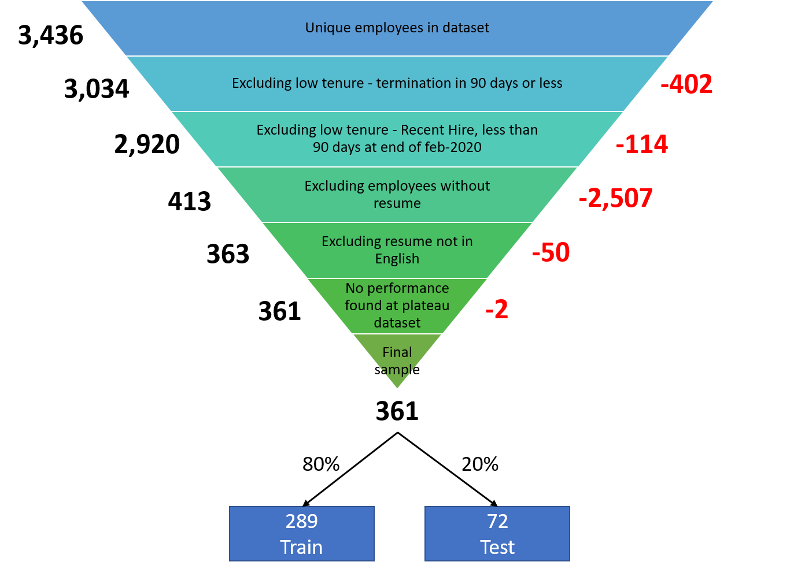
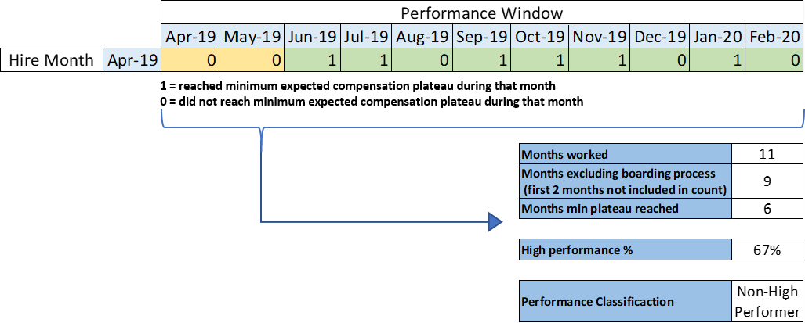
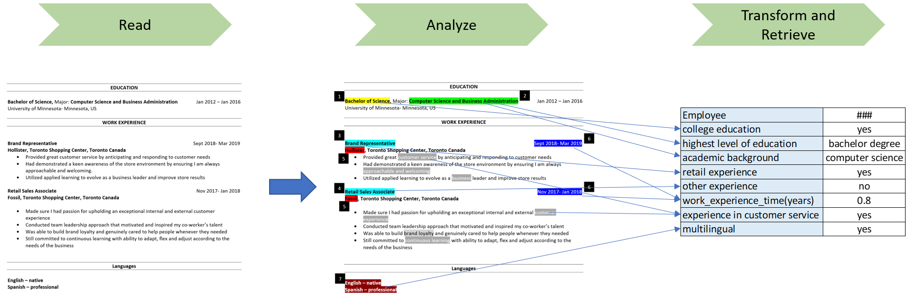
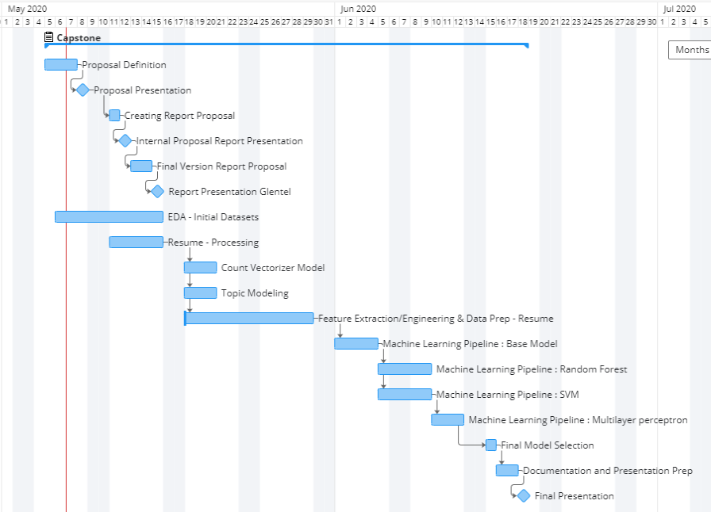

Identifying and Analyzing Traits Associated with High Performers
================
Clara Su, Manuel Maldonado, Robert Pimentel and Thomas Pin - **Mentor**:
Varada Kolhatkar - **Partner Organization**: Glentel
15/05/2020

## Executive Summary

Glentel is a mobile phone retailer that operates 350+ wireless outlets
across Canada. The primary issue they are facing is high employee churn,
which is costly. We propose to use natural language processing
techniques to extract information from employees’ resumes such as
education, employment history and job hopping. The Master of Data
Science (MDS) team will extract such features and provide an analysis of
the extent to which these features contribute to employee performance.
This will provide valuable insight to help Glentel decrease employee
churn and optimize their hiring process.

## Data Science Problem

Glentel has requested tools to introduce evidence-based procedure to
their hiring process. In addition to current COVID 19 crisis, it is
critical that retail organizations have a deep understanding of their
workforce. The question our team would like to help Glentel answer is
**“What are the traits that are associated with employees who become
high performers?”** We want to provide Glentel with a quantitative data
analysis about their staff to make relevant and timely decisions that
could help them decrease employee churn and optimize their workforce.

## Data

Glentel has provided our team with unstructured data of 413 resumes and
structured tabular data such as activations, compensation tier and
termination reasons. Our team has several data challenges that we will
need to overcome. First, due to no universal resume standards each
resume is unique with information spread across the document.
Additionally, we have documents in PDF, doc, docx, rtf and txt forms.
The solution we are working on is creating a resume scanner which will
transform the resumes into plain text. Second, some of the resumes are
blank or in an unreadable form. Based off of a sample size of 150
resumes we estimate that 5%-8% of the total resumes might be unusable
and need to be discarded. Third, due to Canada being a bilingual nation
some of the resumes are in French. We have asked our partner, Glentel,
to prioritize the English ones. Our model will only consider English
resumes for now; however, further into the project we can look into
translating the French resumes into English time permitting if need be.
Finally, after discussing this with the partner, we have narrowed down
our study to employees who worked at Glentel for at least 3 months, have
a resume on file and performance data. Moreover, during modeling, we
will be splitting the data into train and test splits in order to
examine to what extent the patterns we identify in the training set
generalize on the test set. So, the final training size we are left with
is 289, as shown in Figure 1. Due to a lack of resumes’ attributes in
tabular form, a good portion of the MDS team’s time and resources will
be utilized on data cleaning and feature extracting.

 

Figure 1. Granularity of sample size

## Target

The main target for our model’s outcome is to predict employee
performance in binary form: a high performer (1) or a non-high performer
(0). Glentel has recommended that we use pay achievement levels as a
proxy for performance. Each month, an employee can achieve a pay level
between 0 and 4 depending on how many customer phone activations they
attain. In Jan, Feb, Apr, May, Jul and Oct, a pay achievement level of
at least 2 must be achieved and Mar, Jun, Aug, Sept, Nov and Dec a pay
achievement level of at least 3 must be accomplished for an employee to
gain a binary high performer flag for that month. Additionally, an
employee must achieve at least an average of 75% of their monthly
high-performance flags in order to reach an overall target of high
performer. The first two months of employee performance data will be
removed from their average as this is considered an “adjustment” period.

Figure 2. Example target calculation

Figure 2 shows a sample calculation of a fictitious Glentel employee and
how it was determined if that employee was considered high performer or
non-high performer. The fictitious employee worked 11 months; the first
two months will be excluded which narrows the performance window to 9
months. They received a high performance flag in 6 of those 9 months
which results in a 67% high performance average and because their
average is below 75% their final performance classification is non high
performed.

## Our Approach

We propose to use natural language processing (NLP) techniques to
extract information and find patterns in resumes. Our proposed approach
has five major components: plain text extraction, preprocessing and
exploratory data analysis (EDA), feature engineering, modeling,
evaluation and interpretation. Since not all resumes are in plain text
format the first step is to extract plain text from resumes to create a
corpus of plain text resumes. The second step is text preprocessing and
EDA. In this step we preprocess the text (e.g., removing commonly
occurring uninformative words such as ‘the’). Moreover, we also carry
out exploratory data analysis to examine obvious patterns occurring in
the resumes. Additionally, we will also use topic modelling to extract
key words, potential features and insights in addition to retrieving
information from the resumes and count vectorizing the plain text. In
the third step, we will extract other features from these resumes such
as education level, experience, job hopping, and language along with
supplementary tabular date such as re-hire or referral. This will allow
our model to take into consideration key features other than word
occurrences in the resumes. In the fourth step, we will build models
utilizing the resumes plain text plus the extracted features starting
with our base model of logistic regression and then expanding into an
ensemble of models such as support vector machine (SVM), Random Forest
and Multilayer perceptron(simple neural network) to gain insight about
the features of our models. In the final step after selecting the final
model or models, we would like to make our models into “white box”
models instead of “black box” models using tools such as
[“eil5”](https://eli5.readthedocs.io/en/latest/overview.html) and
[“SHAP”](https://github.com/slundberg/shap). We expect to use a
mixture of bag-of-words features as well as features we engineered from
the insights of the topic modeling, Glentel’s expertise and data science
team’s creativity.

Figure 3. Example resume feature extraction

Figure 3 shows an example of potential feature extraction the MDS team
could perform on the Glentel resumes.

## Data Product

Our group will provide Glentel with the MDS GitHub repository that
contains all reports, models and scripts. The final report will consist
of qualitative recommendations on the traits of high performing
employees that Glentel might want to consider when hiring future
employees. The models will include the models, outputs, and
interpretations that the MDS team used to develop those insight in the
final report. The scripts will clean and wrangle the resume data into
machine learning ready spreadsheets.

## Machine Learning Pipeline

The machine learning pipeline will be as follows:

1.  Feature scaling (massaging our features to fit uniformly into our
    model)
2.  Cross validation (better generalization)
3.  Hyperparameter (tuning how the model interprets data)
4.  Feature selection (selecting the attributes of employees)
5.  Model training (prediction)
6.  Model interpretation (drawing insights from the model and jugging
    performance)

our model:

  - **Baseline**: [logistic
    regression](https://scikit-learn.org/stable/modules/generated/sklearn.linear_model.LogisticRegression.html)
  - Ensemble of additional classifiers such as:
      - [SVM](https://scikit-learn.org/stable/modules/generated/sklearn.svm.SVC.html)
      - [Random
        Forest](https://scikit-learn.org/stable/modules/generated/sklearn.ensemble.RandomForestClassifier.html)
      - [Multilayer
        perceptron](https://scikit-learn.org/stable/modules/neural_networks_supervised.html)

## Timeline

Figure 4 shows our proposed timeline for the lifecycle of the project.

Figure 4. MDS team proposed gantt chart

